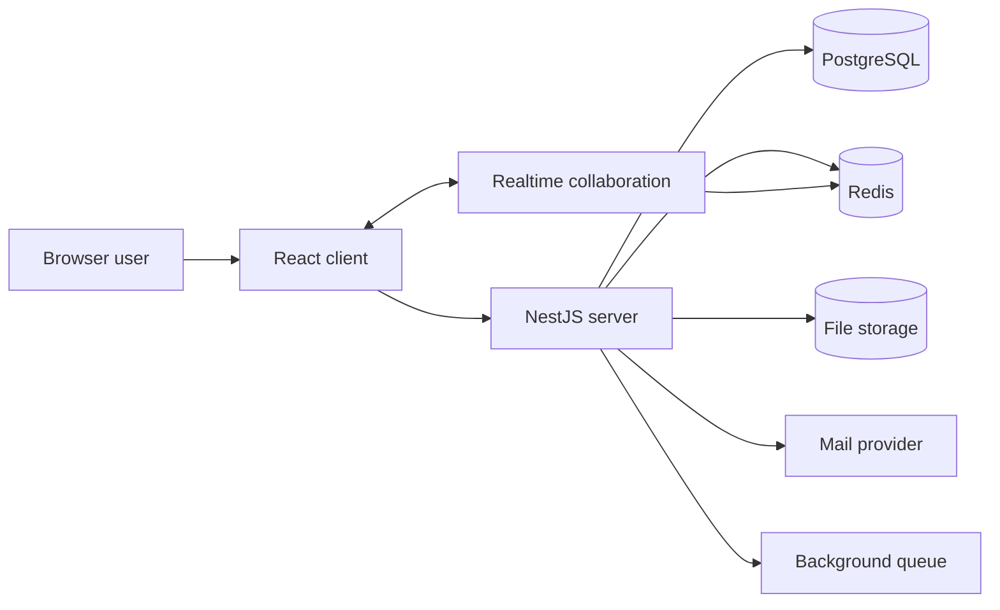

# 4.1 Bản đồ kiến trúc Docmost

Docmost là một case study tốt vì nó có cấu trúc của một ứng dụng SaaS hiện đại: frontend, backend, realtime collaboration, database, cache, storage, queue và deployment bằng Docker. Khi học TypeScript, đọc một repo như Docmost giúp bạn hiểu rằng syntax chỉ là phần nhỏ. Phần lớn năng lực nằm ở việc đọc kiến trúc qua file và folder.

## Bản đồ repo

Ở root, ta thấy các file và thư mục quan trọng:

```text
apps/
  client/
  server/
packages/
  editor-ext/
package.json
pnpm-workspace.yaml
pnpm-lock.yaml
nx.json
Dockerfile
docker-compose.yml
.env.example
```

`apps/client` là frontend React + Vite. `apps/server` là backend NestJS. `packages/editor-ext` là package nội bộ cho editor extension. Root `package.json` điều phối scripts. `pnpm-workspace.yaml` định nghĩa workspace. `nx.json` định nghĩa task graph và caching. Dockerfile mô tả production image. Docker Compose mô tả cách chạy app cùng PostgreSQL và Redis.

## Kiến trúc runtime

Một bản đồ đơn giản của Docmost có thể nhìn như sau:



Browser tải frontend. Frontend gọi backend qua API. Backend đọc và ghi PostgreSQL, dùng Redis cho cache, queue hoặc realtime coordination, dùng storage cho attachment, dùng mail provider cho email. Collaboration cần WebSocket và shared state.

## Vì sao đây là bài học tốt cho AI engineer?

Một AI product cũng có hình dạng tương tự. Thay vì document page, bạn có conversation, trace, retrieval result, tool call và eval result. Thay vì editor collaboration, bạn có streaming response hoặc agent event stream. Thay vì attachment storage, bạn có file upload, vector index hoặc artifact store. Thay vì mail provider, bạn có model provider.

Câu hỏi kiến trúc giống nhau:

- Frontend lấy dữ liệu từ đâu?
- Backend module nào sở hữu business logic?
- Database schema được quản lý thế nào?
- Background job chạy ở đâu?
- Realtime event đi qua kênh nào?
- Config và secrets nằm ở đâu?
- Docker image build ra sao?
- Local dev khác production thế nào?

## Cách đọc từ entry point

Với backend, bắt đầu từ `apps/server/src/main.ts`. File này tạo Nest app, chọn Fastify adapter, set global prefix `api`, đăng ký Redis WebSocket adapter, multipart, cookie, validation pipe, CORS, interceptor và shutdown hooks.

Sau đó đọc `apps/server/src/app.module.ts`. Đây là root module, cho biết hệ thống gồm những module nào: database, environment, collaboration, WebSocket, queue, static, health, import, export, storage, mail, security, telemetry và throttle.

Với frontend, bắt đầu từ `apps/client/src/main.tsx`. File này import global CSS, tạo `QueryClient`, bọc app bằng BrowserRouter, MantineProvider, ModalsProvider, QueryClientProvider, Notifications, HelmetProvider và PostHogProvider.

## Kiến trúc source và kiến trúc runtime khác nhau

Folder structure cho biết source code được tổ chức thế nào. Docker Compose cho biết runtime service chạy thế nào. Hai thứ liên quan nhưng không giống nhau.

Trong source, bạn thấy `apps/client` và `apps/server`. Trong Docker Compose, bạn thấy service `docmost`, `db` và `redis`. Service `docmost` chứa output build của client và server. Service `db` chạy PostgreSQL. Service `redis` chạy Redis.

Khi làm solution architecture, bạn phải đọc cả hai lớp. Nếu chỉ đọc source, bạn không biết dependency runtime. Nếu chỉ đọc Docker Compose, bạn không hiểu module boundary trong code.

## Điều cần giữ lại

Docmost cho thấy một TypeScript production app không chỉ là `.ts` và `.tsx`. Nó là một hệ thống gồm source organization, package management, build graph, runtime services, env config và deployment artifact. Học TypeScript trọn vẹn nghĩa là đọc được toàn bộ bản đồ đó.
