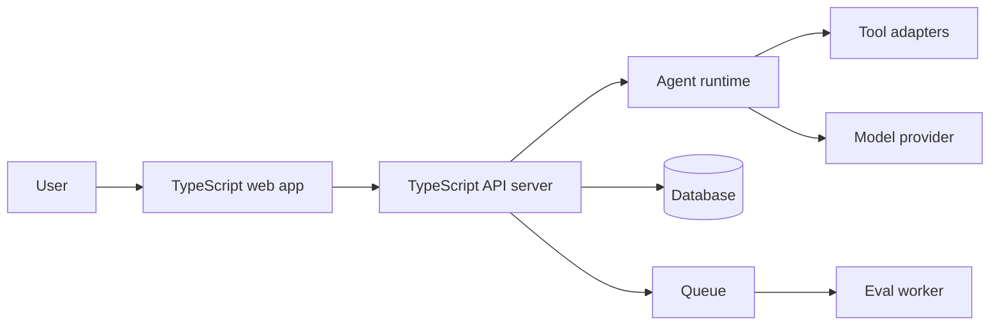

# 6.1 TypeScript trong AI engineering

Nhiều người nghĩ AI engineering chủ yếu là Python. Điều đó đúng nếu bạn nói về training, fine-tuning, data processing hoặc research prototype. Nhưng khi AI đi vào sản phẩm, TypeScript xuất hiện ở rất nhiều lớp: web UI, backend API, agent orchestration, tool calling, dashboards, eval runners, SDK, integrations và workflow automation.

## TypeScript ở lớp sản phẩm

Một AI product thường có kiến trúc như sau:



Python có thể nằm trong model service hoặc data pipeline. TypeScript thường nằm ở lớp tương tác với user, route request, quản lý auth, gọi model provider, gọi tools và ghi trace.

## Tool calling cần type contract

Agent tool là function có schema. Nếu schema mơ hồ, agent dễ gọi sai. TypeScript giúp mô tả tool contract:

```ts
type ToolDefinition<Input, Output> = {
  name: string;
  description: string;
  inputSchema: unknown;
  execute: (input: Input) => Promise<Output>;
};
```

Trong code thật, `inputSchema` nên là Zod schema hoặc JSON Schema. Type generic giúp liên kết input và output. Runtime schema giúp validate dữ liệu model sinh ra.

## Model provider adapter

Đừng rải logic gọi OpenAI, Google, Anthropic hoặc local model khắp codebase. Hãy dùng adapter interface:

```ts
type GenerateTextRequest = {
  prompt: string;
  temperature?: number;
};

type GenerateTextResult = {
  text: string;
  usage?: {inputTokens: number; outputTokens: number};
};

interface ModelProvider {
  generateText(request: GenerateTextRequest): Promise<GenerateTextResult>;
}
```

Với interface này, service phía trên không cần biết provider cụ thể. Bạn có thể thay provider, mock trong test, hoặc thêm fallback.

## Traces và evals

AI systems cần trace. Trace không chỉ là log text. Nó là dữ liệu có schema: input, steps, tool calls, model responses, latency, token usage, errors, final answer và score.

TypeScript type cho trace giúp frontend, backend và eval worker thống nhất:

```ts
type AgentStep =
  | {kind: 'model'; prompt: string; output: string; latencyMs: number}
  | {kind: 'tool'; name: string; input: unknown; output: unknown; latencyMs: number}
  | {kind: 'error'; message: string; retryable: boolean};
```

Union type giúp UI render từng step đúng cách và backend xử lý từng loại step rõ ràng.

## Security và permission

AI agent thường có tool nguy hiểm: đọc file, ghi database, gọi API, gửi email, chạy command. TypeScript không tự giải quyết security, nhưng giúp bạn mô hình hóa permission.

```ts
type Permission = 'read:docs' | 'write:docs' | 'run:eval' | 'manage:workspace';

type ToolContext = {
  userId: string;
  workspaceId: string;
  permissions: Permission[];
};
```

Tool execution nên nhận context và kiểm tra permission trước khi hành động. Không nên để model output trực tiếp quyết định action nguy hiểm.

## Điều cần giữ lại

TypeScript là ngôn ngữ rất mạnh cho lớp sản phẩm của AI: API, UI, tools, traces, evals và integrations. Python vẫn quan trọng cho ML core. Nhưng nếu muốn trở thành AI engineer hoặc solution architect, bạn cần TypeScript để biến model thành hệ thống dùng được.
