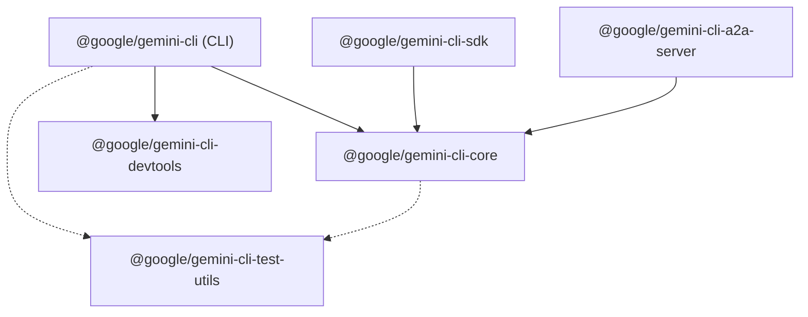
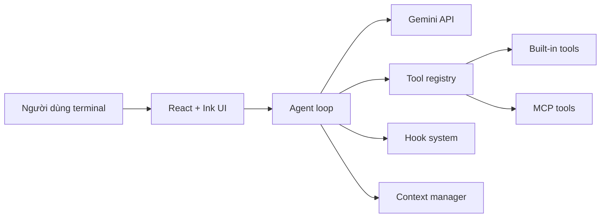

# 7.1 Bản đồ kiến trúc Gemini CLI

Gemini CLI (`google-gemini/gemini-cli`, Apache 2.0) là một production TypeScript monorepo xây dựng AI agent chạy trên terminal. Nếu Docmost dạy bạn cách tổ chức một ứng dụng web SaaS, Gemini CLI dạy bạn cách tổ chức một **AI agent**: agent loop, tool registry, MCP plugin system, terminal UI và SDK cho người dùng programmatic. Đây là những pattern bạn sẽ gặp khi xây dựng AI tool, AI assistant hoặc AI copilot.

## Bản đồ repo

Root của Gemini CLI chứa các thành phần chính:

```text
packages/
  core/              # Logic trung tâm: agent loop, tools, hooks, context
  cli/               # Giao diện terminal dùng React + Ink
  sdk/               # Public API cho người dùng programmatic
  a2a-server/        # Agent-to-Agent server (HTTP)
  devtools/          # DevTools integration
  test-utils/        # Shared test utilities
  vscode-ide-companion/  # VS Code extension
package.json         # npm workspaces root
tsconfig.json        # TypeScript config gốc (rất nghiêm ngặt)
esbuild.config.js    # Bundle config cho distribution
```

Mỗi package có `package.json` riêng và `tsconfig.json` riêng. `packages/core` có ~95 dependencies, là trái tim của hệ thống. `packages/cli` phụ thuộc core qua `"@google/gemini-cli-core": "file:../core"`. `packages/sdk` cũng phụ thuộc core theo cách tương tự.

## Package dependency graph



`core` là package trung tâm mà mọi package khác phụ thuộc vào. `cli` là ứng dụng terminal mà người dùng cuối chạy. `sdk` là thư viện cho developer nhúng Gemini CLI vào ứng dụng khác. `a2a-server` là HTTP server cho giao thức Agent-to-Agent. `test-utils` là package nội bộ cho testing.

## Kiến trúc runtime

Khi bạn chạy `gemini "viết hàm sort"`, luồng dữ liệu đi qua các lớp:



**CLI layer** (`packages/cli`) nhận input từ người dùng, render output bằng React và Ink lên terminal. Nó parse argument, load config, quản lý auth và delegate toàn bộ logic AI cho core.

**Core layer** (`packages/core`) chạy agent loop: gửi prompt đến Gemini API, nhận response dưới dạng stream, parse tool call, thực thi tool qua scheduler, trả kết quả về cho model, lặp lại cho đến khi model dừng. Core cũng quản lý context (history, compression), hooks (before/after tool), policy (approval), và routing (model selection).

**Tool layer** là hệ thống hơn 20 built-in tools (`read-file`, `write-file`, `edit`, `shell`, `grep`, `glob`, `web-search`, `web-fetch`, v.v.) cộng với các tool được discover từ MCP server. Mỗi tool là một class TypeScript với schema, validation, execute và policy check.

## Quyết định TypeScript đáng chú ý

### ESM-only với NodeNext

```json
{
  "type": "module",
  "compilerOptions": {
    "module": "NodeNext",
    "moduleResolution": "nodenext",
    "target": "es2022"
  }
}
```

Gemini CLI dùng ESM hoàn toàn. Mọi `import` phải có extension `.js` (dù source là `.ts`). Đây là convention hiện đại nhất cho Node.js TypeScript project, khác với Docmost dùng CommonJS-compatible module resolution.

### Strict TypeScript cực cao

```json
{
  "compilerOptions": {
    "strict": true,
    "noImplicitOverride": true,
    "noImplicitReturns": true,
    "noUnusedLocals": true,
    "noPropertyAccessFromIndexSignature": true,
    "verbatimModuleSyntax": true,
    "strictBindCallApply": true,
    "strictFunctionTypes": true,
    "strictNullChecks": true,
    "strictPropertyInitialization": true
  }
}
```

Đây là một trong những tsconfig nghiêm ngặt nhất bạn sẽ gặp. `noPropertyAccessFromIndexSignature` buộc bạn dùng `obj["key"]` thay vì `obj.key` cho index signature. `verbatimModuleSyntax` buộc `import type` cho type-only import. `noUnusedLocals` không cho phép biến không sử dụng. Khi làm AI agent với nhiều type phức tạp (tool result, event stream, discriminated union), strictness này giúp tránh bug ở compile time.

### React JSX cho terminal

```json
{
  "compilerOptions": {
    "jsx": "react-jsx"
  }
}
```

Gemini CLI dùng `.tsx` không phải cho browser mà cho terminal. React + Ink render React component thành terminal output. Đây là ví dụ tuyệt vời rằng JSX không gắn liền với DOM  -  nó chỉ là syntax cho component tree, renderer có thể là bất cứ thứ gì.

### npm workspaces (không phải pnpm)

Khác với Docmost dùng pnpm + Nx, Gemini CLI dùng npm workspaces thuần:

```json
{
  "workspaces": ["packages/*"]
}
```

Điều này đơn giản hơn, không cần tool orchestration bên ngoài. Build script (`scripts/build.js`) tự quản lý thứ tự build theo dependency.

## Vì sao đây là bài học tốt cho AI engineer?

Khi xây AI agent, bạn sẽ cần:

- **Agent loop**: gửi prompt → nhận response → parse tool call → execute → lặp. Gemini CLI triển khai pattern này bằng TypeScript với discriminated union event (`GeminiEventType`), streaming response và retry logic.
- **Tool system**: mỗi tool cần schema (cho model biết cách gọi), validation (đảm bảo param hợp lệ), execution (chạy logic), policy (hỏi user trước khi chạy lệnh nguy hiểm). Đây là pattern bạn sẽ lặp lại trong mọi AI agent.
- **MCP plugin**: thay vì hard-code mọi tool, Gemini CLI cho phép discover tool từ MCP server bên ngoài. Đây là tương lai của AI tool integration.
- **Terminal UI**: nhiều AI tool chạy trên CLI, không phải browser. React + Ink là pattern đáng biết.
- **SDK**: nếu bạn muốn người khác nhúng AI agent vào ứng dụng của họ, bạn cần public API design tốt. Gemini CLI SDK (`packages/sdk`) là ví dụ.

Câu hỏi kiến trúc giống nhau giữa Docmost và Gemini CLI:

- Entry point ở đâu?
- Module boundary nằm ở đâu?
- Config và secret quản lý thế nào?
- Build pipeline hoạt động ra sao?
- Test strategy là gì?
- Production artifact là gì?

Câu trả lời khác nhau hoàn toàn vì domain khác nhau. Docmost build Docker image, Gemini CLI build single `bundle/gemini.js` cho `npx`. Docmost có REST API, Gemini CLI có tool call protocol. So sánh hai case study giúp bạn hiểu rằng TypeScript linh hoạt hơn bạn nghĩ.

## Điều cần giữ lại

Gemini CLI cho thấy TypeScript không chỉ cho web app. Nó xây được AI agent production với agent loop, tool registry, plugin system và terminal UI  -  tất cả type-safe, tất cả strict mode, tất cả ESM. Bản đồ kiến trúc ở đây sẽ là reference khi bạn đọc sâu từng lớp ở các bài tiếp theo.
