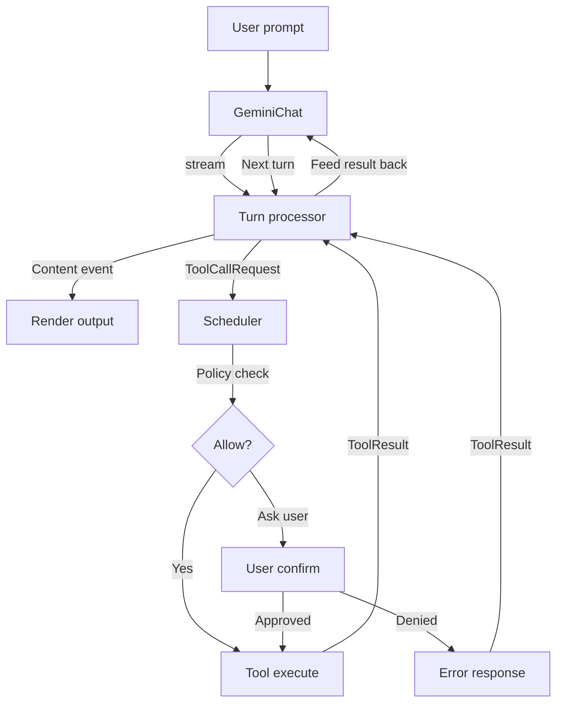

# 7.3 Đọc agent loop trong core

Agent loop là trái tim của Gemini CLI. Nó trả lời câu hỏi: khi người dùng gõ một prompt, hệ thống làm gì từ lúc gửi request đến Gemini API cho đến lúc trả kết quả về terminal? Bài này đọc 4 file quan trọng nhất trong `packages/core` để bạn hiểu pattern.

## Entry point: `packages/core/src/index.ts`

File `index.ts` (315 dòng) chỉ chứa re-export. Nó là public API surface của core:

```typescript
// Export Core Logic
export * from './core/contentGenerator.js';
export * from './core/geminiChat.js';
export * from './core/turn.js';
export * from './scheduler/scheduler.js';

// Export base tool definitions
export * from './tools/tools.js';
export * from './tools/tool-registry.js';

// Export hooks system
export * from './hooks/index.js';
export * from './hooks/types.js';

// ... ~300 dòng re-export khác
```

Khi bạn thấy một file `index.ts` re-export hàng trăm module, đó là dấu hiệu của package lớn có nhiều consumer khác nhau. CLI import từ `@google/gemini-cli-core` và lấy đúng những gì nó cần. SDK cũng vậy nhưng dùng subset khác. Pattern này gọi là **barrel file**  -  một file duy nhất gom tất cả export lại, giúp consumer không cần biết structure bên trong.

## Event type: Discriminated union cho agent stream

File `core/turn.ts` (524 dòng) định nghĩa event system của agent loop. Điểm xuất phát là enum `GeminiEventType`:

```typescript
export enum GeminiEventType {
  Content = 'content',
  ToolCallRequest = 'tool_call_request',
  ToolCallResponse = 'tool_call_response',
  ToolCallConfirmation = 'tool_call_confirmation',
  UserCancelled = 'user_cancelled',
  Error = 'error',
  ChatCompressed = 'chat_compressed',
  Thought = 'thought',
  MaxSessionTurns = 'max_session_turns',
  Finished = 'finished',
  LoopDetected = 'loop_detected',
  Citation = 'citation',
  Retry = 'retry',
  ContextWindowWillOverflow = 'context_window_will_overflow',
  InvalidStream = 'invalid_stream',
  ModelInfo = 'model_info',
  AgentExecutionStopped = 'agent_execution_stopped',
  AgentExecutionBlocked = 'agent_execution_blocked',
}
```

Mỗi event type có type tương ứng:

```typescript
export type ServerGeminiContentEvent = {
  type: GeminiEventType.Content;
  value: string;
  traceId?: string;
};

export type ServerGeminiToolCallRequestEvent = {
  type: GeminiEventType.ToolCallRequest;
  value: ToolCallRequestInfo;
};

export type ServerGeminiFinishedEvent = {
  type: GeminiEventType.Finished;
  value: GeminiFinishedEventValue;
};
```

Tất cả ghép thành discriminated union:

```typescript
export type ServerGeminiStreamEvent =
  | ServerGeminiContentEvent
  | ServerGeminiToolCallRequestEvent
  | ServerGeminiToolCallResponseEvent
  | ServerGeminiFinishedEvent
  | ServerGeminiErrorEvent
  // ... 12+ types khác
```

**Pattern**: discriminated union cho phép `switch` exhaustively. Khi bạn xử lý event stream:

```typescript
for await (const event of agentLoop.run()) {
  switch (event.type) {
    case GeminiEventType.Content:
      // TypeScript biết event.value là string
      render(event.value);
      break;
    case GeminiEventType.ToolCallRequest:
      // TypeScript biết event.value là ToolCallRequestInfo
      scheduleTool(event.value);
      break;
    // ...
  }
}
```

TypeScript bắt bạn xử lý mọi case (nếu dùng `exhaustive switch`), giúp không bỏ sót event type. Đây là lợi thế lớn nhất của TypeScript khi làm AI agent so với Python  -  bạn biết compile time rằng mình đã xử lý hết mọi loại event chưa.

## Content generator: Streaming từ Gemini API

File `core/geminiChat.ts` (1475 dòng) quản lý việc gọi Gemini API và xử lý stream response. Một số pattern quan trọng:

### Stream event type

```typescript
export enum StreamEventType {
  CHUNK = 'chunk',
  RETRY = 'retry',
  AGENT_EXECUTION_STOPPED = 'agent_execution_stopped',
  AGENT_EXECUTION_BLOCKED = 'agent_execution_blocked',
}

export type StreamEvent =
  | { type: StreamEventType.CHUNK; value: GenerateContentResponse }
  | { type: StreamEventType.RETRY }
  | { type: StreamEventType.AGENT_EXECUTION_STOPPED; reason: string }
  | { type: StreamEventType.AGENT_EXECUTION_BLOCKED; reason: string };
```

Mỗi chunk từ Gemini API được wrap trong `StreamEvent`. Khi stream bị disconnect, hệ thống emit `RETRY` để UI biết mà discard partial content, rồi retry với exponential backoff:

```typescript
const MID_STREAM_RETRY_OPTIONS: MidStreamRetryOptions = {
  maxAttempts: 4,        // 1 initial + 3 retries
  initialDelayMs: 1000,
  useExponentialBackoff: true,
};
```

### Validation trước khi trả về

```typescript
function isValidResponse(response: GenerateContentResponse): boolean {
  if (response.candidates === undefined || response.candidates.length === 0) {
    return false;
  }
  const content = response.candidates[0]?.content;
  if (content === undefined) return false;
  return isValidContent(content);
}
```

Không phải response nào từ API cũng hợp lệ. Đôi khi API trả về empty candidate, đôi khi content không có parts. `geminiChat.ts` validate mỗi response trước khi yield ra ngoài. Pattern này quan trọng: **không tin API response, luôn validate ở boundary**.

## Scheduler: Orchestrator cho tool execution

File `scheduler/scheduler.ts` (962 dòng) là orchestrator điều phối tool execution. Khi model trả về tool call request, scheduler nhận request, check policy, có thể hỏi user confirm, rồi execute:

```typescript
/**
 * Event-Driven Orchestrator for Tool Execution.
 * Coordinates execution via state updates and event listening.
 */
export class Scheduler {
  private readonly state: SchedulerStateManager;
  private readonly executor: ToolExecutor;
  private readonly modifier: ToolModificationHandler;
  private readonly config: Config;
  private readonly context: AgentLoopContext;
  private readonly messageBus: MessageBus;
  private isProcessing = false;
  private readonly requestQueue: SchedulerQueueItem[] = [];

  async schedule(
    request: ToolCallRequestInfo | ToolCallRequestInfo[],
    signal: AbortSignal,
  ): Promise<CompletedToolCall[]> {
    // ...
  }
}
```

### Queue-based processing

Scheduler dùng request queue. Khi model trả về nhiều tool call cùng lúc (parallel tool calls), tất cả được đẩy vào queue và xử lý:

```typescript
interface SchedulerQueueItem {
  requests: ToolCallRequestInfo[];
  signal: AbortSignal;
  resolve: (results: CompletedToolCall[]) => void;
  reject: (reason?: Error) => void;
}
```

### Policy check và confirmation

Trước khi execute bất kỳ tool nào, scheduler check policy. Policy quyết định tool được tự động chạy (`allow`), bị từ chối (`deny`), hay cần hỏi user (`ask_user`). MessageBus là kênh giao tiếp giữa scheduler và UI cho việc hỏi confirm:

```typescript
messageBus.subscribe(
  MessageBusType.TOOL_CONFIRMATION_REQUEST,
  this.handleToolConfirmationRequest,
  { signal: this.disposeController.signal },
);
```

Pattern ở đây là **event-driven architecture**: scheduler không gọi UI trực tiếp. Nó publish event lên message bus, UI subscribe và respond. Điều này giúp core không phụ thuộc vào CLI  -  cùng core đó có thể chạy với SDK (headless) mà không cần terminal UI.

## Agent session: Orchestration ở tầng cao hơn

File `agent/agent-session.ts` (226 dòng) wrap agent protocol thành AsyncIterable API tiện dụng hơn:

```typescript
export class AgentSession implements AgentProtocol {
  async send(payload: AgentSend): Promise<{ streamId: string | null }> {
    return this._protocol.send(payload);
  }

  subscribe(callback: (event: AgentEvent) => void): Unsubscribe {
    return this._protocol.subscribe(callback);
  }

  async *sendStream(payload: AgentSend): AsyncIterable<AgentEvent> {
    const result = await this._protocol.send(payload);
    const streamId = result.streamId;
    if (streamId === null) return;
    yield* this.stream({ streamId });
  }
}
```

`sendStream` là phương thức chính mà CLI và SDK dùng. Nó nhận prompt, gửi đến agent, và trả về AsyncIterable yield từng event. AsyncIterable là pattern TypeScript-native cho stream  -  không cần thư viện ngoài, `for await...of` hoạt động trực tiếp.

## Luồng chạy tổng hợp



Luồng chạy:

1. Người dùng gửi prompt
2. `GeminiChat` gọi Gemini API, nhận stream response
3. `Turn` processor parse stream thành `ServerGeminiStreamEvent`
4. Nếu event là `Content`, render ra terminal
5. Nếu event là `ToolCallRequest`, scheduler nhận request
6. Scheduler check policy → có thể hỏi user → execute tool
7. Tool result được trả về cho Turn
8. Turn feed result back vào GeminiChat
9. GeminiChat gọi API lần nữa với tool result trong history
10. Lặp lại từ bước 2 cho đến khi model trả về `Finished` event

## Điều cần giữ lại

Agent loop của Gemini CLI dùng 3 pattern TypeScript quan trọng: **discriminated union** cho event type, **AsyncIterable** cho streaming, và **message bus** cho event-driven communication giữa core và UI. Ba pattern này xuất hiện trong hầu hết AI agent production system. Khi bạn xây AI agent riêng, hãy bắt đầu từ discriminated union event type  -  nó sẽ hướng dẫn toàn bộ architecture còn lại.
