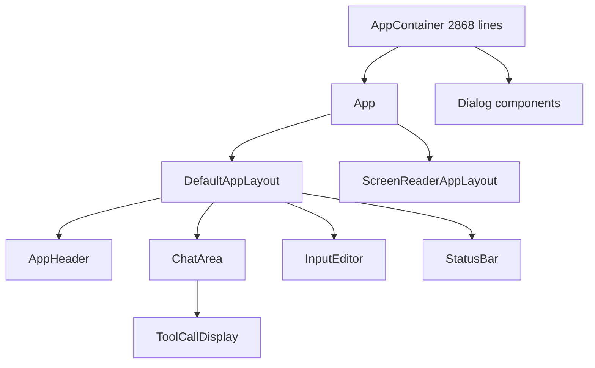

# 7.5 Terminal UI với React và Ink

Gemini CLI dùng React  -  nhưng không phải cho browser. Nó dùng **Ink**, một framework render React component ra terminal output thay vì DOM. Nếu bạn nghĩ React chỉ dành cho web, bài này sẽ thay đổi cách nhìn. JSX chỉ là syntax cho component tree; renderer có thể là bất cứ thứ gì.

## Ink là gì?

Ink là thư viện cho phép viết CLI app bằng React component. Nó dùng **Yoga** (Flexbox layout engine của Facebook) để tính layout, rồi render ra ANSI escape code lên terminal. Bạn viết `<Box>`, `<Text>`, `<Box flexDirection="column">`  -  Ink chuyển thành terminal output với màu sắc, padding, spacing.

```tsx
// Ví dụ Ink đơn giản
import React from 'react';
import { render, Text, Box } from 'ink';

const App = () => (
  <Box flexDirection="column" padding={1}>
    <Text bold color="green">Hello from Ink!</Text>
    <Text>This renders in your terminal.</Text>
  </Box>
);

render(<App />);
```

Điểm khác biệt với React web: không có DOM, không có `document`, không có browser event. Thay vào đó, Ink lắng nghe stdin cho keypress, dùng Yoga cho layout, và ANSI code cho rendering. Nhưng mental model giống hệt: component, props, state, hooks, context  -  tất cả đều hoạt động.

## Entry point: `gemini.tsx` (974 dòng)

File `packages/cli/src/gemini.tsx` là entry point của CLI. Nó là file `.tsx`  -  đúng vậy, file TypeScript JSX nhưng chạy trên Node.js, không phải browser. Nhiệm vụ chính:

```typescript
// gemini.tsx  -  import từ @google/gemini-cli-core
import {
  type Config,
  AuthType,
  coreEvents,
  patchStdio,
  ExitCodes,
  debugLogger,
  // ... hàng chục import khác
} from '@google/gemini-cli-core';
```

Flow chính của `gemini.tsx`:

1. **Parse arguments**: yargs parse CLI flags (`--model`, `--sandbox`, `--resume`, v.v.)
2. **Load settings**: đọc config từ `~/.gemini/settings.json` và `.gemini/settings.json` (project)
3. **Check memory args**: tự động tăng V8 heap size nếu cần (`--max-old-space-size`)
4. **Auth**: validate authentication (OAuth, API key, hoặc Google Cloud)
5. **Initialize core**: tạo `Config`, `ToolRegistry`, `MessageBus`
6. **Render UI**: gọi `startInteractiveUI()` hoặc `runNonInteractive()`

### Memory management

Một chi tiết thú vị: `gemini.tsx` tự kiểm tra heap size và relaunch process với nhiều memory hơn nếu cần:

```typescript
export function getNodeMemoryArgs(isDebugMode: boolean): string[] {
  const totalMemoryMB = os.totalmem() / (1024 * 1024);
  const targetMaxOldSpaceSizeInMB = Math.floor(totalMemoryMB * 0.5);
  // Nếu heap hiện tại < target, relaunch với --max-old-space-size
}
```

AI agent consume nhiều memory (conversation history, tool output, context). Việc tự động expand heap là production-grade engineering.

## Interactive UI: React component tree

File `interactiveCli.tsx` (276 dòng) khởi tạo Ink app:

```typescript
import React from 'react';
import { render } from 'ink';
import { AppContainer } from './ui/AppContainer.js';

export async function startInteractiveUI(config, settings, ...) {
  // Setup terminal: alternate buffer, mouse events, line wrapping
  const useAlternateBuffer = shouldEnterAlternateScreen(config.getUseAlternateBuffer());
  if (useAlternateBuffer) {
    enableMouseEvents();
    disableLineWrapping();
  }

  // Render React component tree
  const { waitUntilExit } = render(
    <AppContainer
      config={config}
      settings={settings}
      resumedSessionData={resumedSessionData}
    />
  );
  await waitUntilExit();
}
```

`render()` từ Ink nhận JSX và bắt đầu render loop. `waitUntilExit()` trả về Promise resolve khi user thoát app. Đây là async/await pattern kết hợp với React render  -  rất TypeScript.

### Component tree



**`AppContainer`** (2868 dòng!) là component lớn nhất. Nó quản lý toàn bộ state:

- Authentication state
- Conversation history
- Streaming state
- Tool call confirmation dialog
- Settings thay đổi
- Memory monitoring
- Session management

```typescript
// AppContainer.tsx  -  hooks usage
import { useMemo, useState, useCallback, useEffect, useRef, useLayoutEffect, useContext } from 'react';
import { useApp, useStdout, useStdin } from 'ink';
```

Mọi React hook đều hoạt động: `useState` cho state, `useEffect` cho side effect, `useCallback` cho memoization, `useRef` cho mutable reference. `useApp()`, `useStdout()`, `useStdin()` là Ink-specific hooks cho terminal access.

**`App`** (39 dòng) là component nhỏ, chỉ quyết định layout:

```tsx
export const App = () => {
  const uiState = useUIState();
  const isScreenReaderEnabled = useIsScreenReaderEnabled();

  if (uiState.quittingMessages) {
    return <QuittingDisplay />;
  }
  return (
    <StreamingContext.Provider value={uiState.streamingState}>
      {isScreenReaderEnabled ? <ScreenReaderAppLayout /> : <DefaultAppLayout />}
    </StreamingContext.Provider>
  );
};
```

Accessibility được quan tâm: screen reader mode dùng layout riêng, không alternate buffer, không line wrapping gây khó đọc.

### Context providers

AppContainer wrap app trong nhiều Context Provider:

```tsx
<SettingsContext.Provider value={settings}>
  <MouseProvider>
    <ScrollProvider>
      <TerminalProvider>
        <OverflowProvider>
          <SessionStatsProvider>
            <VimModeProvider>
              <KeypressProvider>
                <KeyMatchersProvider>
                  <App />
                </KeyMatchersProvider>
              </KeypressProvider>
            </VimModeProvider>
          </SessionStatsProvider>
        </OverflowProvider>
      </TerminalProvider>
    </ScrollProvider>
  </MouseProvider>
</SettingsContext.Provider>
```

Đây là standard React pattern: context cho dependency injection. Mỗi provider cung cấp data hoặc behavior cho subtree. `VimModeProvider` cho Vim keybinding, `ScrollProvider` cho scrollback, `MouseProvider` cho mouse event handling  -  tất cả trong terminal.

## UI components

Thư mục `packages/cli/src/ui/` chứa ~30+ components:

```text
ui/
  components/
    AppHeader.tsx         # Header với version, model info
    AskUserDialog.tsx     # Dialog khi tool cần user input
    Banner.tsx            # Startup banner
    Checklist.tsx         # Step checklist
    CliSpinner.tsx        # Loading spinner
    ToolCallDisplay.tsx   # Hiển thị tool call và result
    QuittingDisplay.tsx   # Exit screen
    AnsiOutput.tsx        # Render ANSI terminal output
    BackgroundTaskDisplay.tsx  # Background task status
  contexts/
    AppContext.tsx
    SettingsContext.tsx
    StreamingContext.tsx
    VimModeContext.tsx
    MouseContext.tsx
    ScrollProvider.tsx
    KeypressContext.tsx
  hooks/
    useHistoryManager.ts
    useMemoryMonitor.ts
    useThemeCommand.ts
    useAlternateBuffer.ts
    useConsoleMessages.ts
  layouts/
    DefaultAppLayout.tsx
    ScreenReaderAppLayout.tsx
  editors/
    # Text editors cho input
  themes/
    # Color themes
```

Mỗi component đều là `.tsx`  -  TypeScript JSX. Mỗi component test bằng `.test.tsx`. Pattern giống hệt React web app, chỉ khác renderer.

## Non-interactive mode

Gemini CLI cũng hỗ trợ headless mode (không có terminal UI):

```typescript
// nonInteractiveCli.ts (608 dòng)
export async function runNonInteractive(params: RunNonInteractiveParams) {
  const { config, input, prompt_id } = params;
  // Tạo Scheduler, subscribe event, process từng event
  // Output JSON hoặc text tùy format
}
```

Non-interactive mode dùng cho CI/CD, scripting, hoặc pipe input/output. Nó không render React  -  thay vào đó, nó subscribe trực tiếp vào event stream và format output.

Hai mode chia sẻ cùng core logic (agent loop, tool system, scheduler). Chỉ UI layer khác nhau. Đây là lý do kiến trúc tách core khỏi CLI: **cùng một core, nhiều renderer**.

## So sánh với React web

| | React Web | React + Ink |
|---|-----------|-------------|
| **Renderer** | react-dom (browser DOM) | ink (terminal ANSI) |
| **Layout** | CSS Flexbox/Grid | Yoga (Flexbox only) |
| **Input** | Browser events | stdin keypress |
| **Styling** | CSS, CSS-in-JS | Color, bold, italic props |
| **State** | useState, useEffect | Giống hệt |
| **Context** | React.createContext | Giống hệt |
| **Routing** | React Router | Không cần (single view) |
| **File type** | `.tsx` | `.tsx` |

Điểm mấu chốt: JSX không phải "React DOM syntax". JSX là syntax extension cho JavaScript, compile thành `React.createElement()` calls. React core chỉ là virtual DOM reconciler  -  nó diff virtual tree rồi apply changes vào renderer. DOM renderer tạo HTML element, Ink renderer tạo ANSI escape code.

## Pattern cho AI engineer

Khi xây AI tool chạy trên CLI, bạn có 3 lựa chọn UI:

1. **Plain text output**: đơn giản nhất, `console.log()` kết quả. Phù hợp tool nhỏ.
2. **Rich terminal (chalk, ora)**: thêm màu, spinner, progress bar. Phù hợp tool vừa.
3. **React + Ink**: full component model, state management, complex layout. Phù hợp AI agent với conversation, tool call, confirmation dialog, streaming response.

Gemini CLI chọn option 3 vì UI phức tạp: streaming text, tool call visualization, confirmation dialog, scrollback, mouse support, alternate buffer. Khi AI agent của bạn có nhiều interactive element, React + Ink là investment đáng giá.

## Điều cần giữ lại

React + Ink cho thấy component model không giới hạn ở browser. Terminal cũng là rendering target. JSX, hooks, context, provider pattern  -  tất cả hoạt động như cũ. Khi bạn thấy `.tsx` trong codebase Node.js, đừng nghĩ "web app"  -  hãy nghĩ "component tree" và tìm renderer. Trong Gemini CLI, renderer là Ink, và nó tạo ra terminal UI production-grade với accessibility, theming, và responsive layout.
